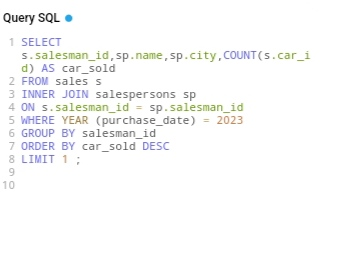

# Steve-s-Car-Showroom

--
## Introduction 
This is a SQL challenge on **steve's car showroom**.My task is to generate valuable insights for a top-end car showroom.

## Tables 
The tables contains analysis of sales, cars and salespersons.
 
 
## Approach
I copied the table creation code in the schema SQL section,inside SQL online then i started writing the queries in the Query SQL section.

## Problem Statement
1. What is the details of all cars purchased in the year 2022 ?
2. What is the total number of cars sold by each salesperson ?
3. What is the total revenue generated by each salesperson?
4. What are the details of the cars sold by each salesperson?
5. What is the total revenue generated by each car type?
6. What is the details of the cars sold in the year 2023 by salesperson 'Emily Wong' ?
7. What is the total revenue generated by the sales of hatchback cars?
8. What is the total revenue generated by the sales of SUV cars in the year 2022 ?
9. What is the name and city of the salesperson who sold the most number of cars in the year 2023?
10.  What is the name and age of the salesperson who generated the highest revenue in the year 2022 ?
 
# # Concepts demostrated
The following SQL functions are incoporated
INNER JOIN, ON,AND, WHERE, GROUP BY, ORDER BY, HAVING

## Analysis
1.  What is the details of all cars purchased in the year 2022 ?

     Query                  |        Answer
    :----------------------:|:-------------------                      
            |   

2.  What is the total number of cars sold by each salesperson ?

 Query                  |        Answer
    :----------------------:|:-------------------                      
            |   

 3.What is the total revenue generated by each salesperson?

     Query                  |        Answer
    :----------------------:|:-------------------                      
            |   
      
 4. What are the details of the cars sold by each salesperson?

      .Query                  |        Answer
    :----------------------:|:-------------------                      
            |   
      
5. What is the total revenue generated by each car type?

    Query                  |        Answer
    :----------------------:|:-------------------                      
            |   
6.  What is the details of the cars sold in the year 2023 by salesperson 'Emily Wong' ?

     Query                  |        Answer
    :----------------------:|:-------------------                      
            |   
      
7.What is the total revenue generated by the sales of hatchback cars?
        Query                |        Answer
    :----------------------:|:-------------------                      
            |   
      
8. What is the total revenue generated by the sales of SUV cars in the year 2022 ? 
      Query                  |        Answer
    :----------------------:|:-------------------                      
            |   
  
9. What is the name and city of the salesperson who sold the most number of cars in the year 2023?
     Query                  |        Answer
    :----------------------:|:-------------------                      
            |   
10. What is the name and age of the salesperson who generated the highest revenue in the year 2022 ?
     Query                  |        Answer
    :----------------------:|:-------------------                      
            |   
    

  ## insights
1. The cars purchased in the year 2022 are 8 showing each details
2. John smith sold 5, Emily Wong sold 5, Tom lee sold 6 and lucy Chen sold 4
3. John smith generated a revenue of $181000, Emily Wong $177000,Tom lee $253000 and lucy Chen $171000
4. The details of the car sold by each salesperson is showed above
5. Civic generated a revenue of $90000, corolls $100000, Explorer $80000, camaro $ 72000, X5 $220000, A4 $48000, C-Class $120000, Altima $52000
6. The details of the cars sold in the year 2023 by salesperson 'Emily Wong' is two showed above
7. The total revenue generated by the sales of hatchback cars is $100000
8. The total revenue generated by the sales of SUV cars in the year 2022 IS $150000
9. The name and city of the salesperson who sold the most number of cars in the year 2023 wasTOM LEE IN SEATTLE
10. he name and age of the salesperson who generated the highest revenue in the year 2022 was EMILY WONG and 35 years of age 

   Thank you for reading. 

  
  

   
     

